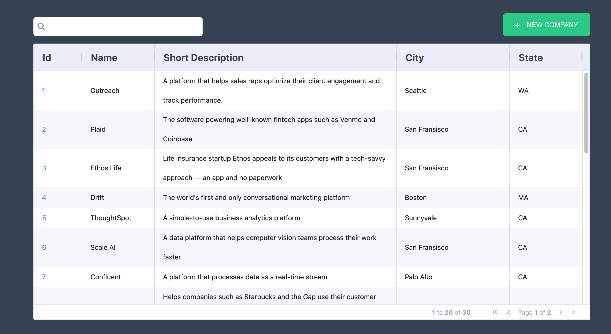
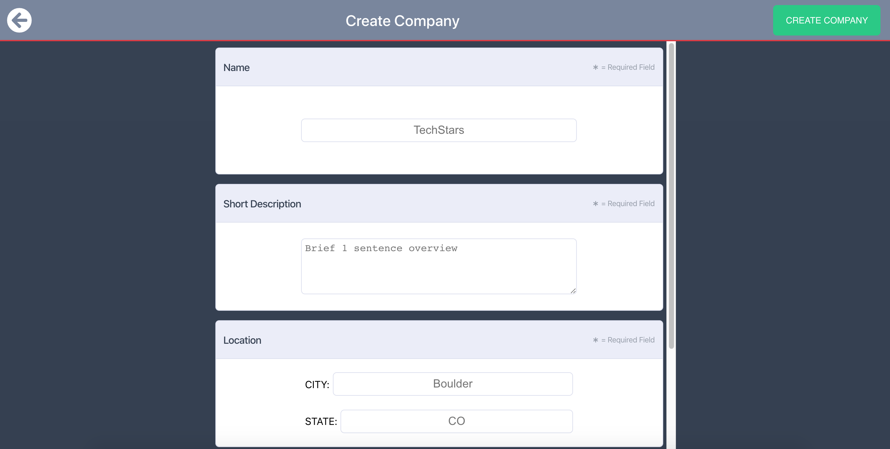
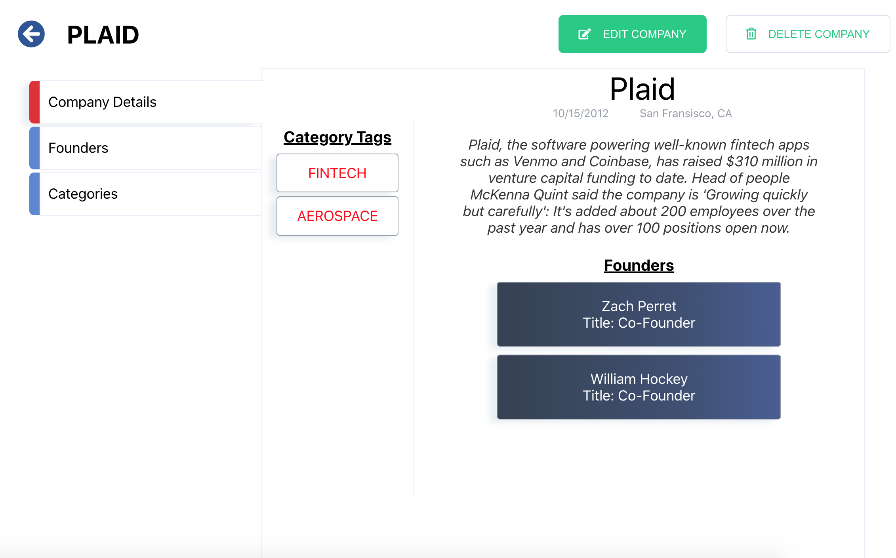
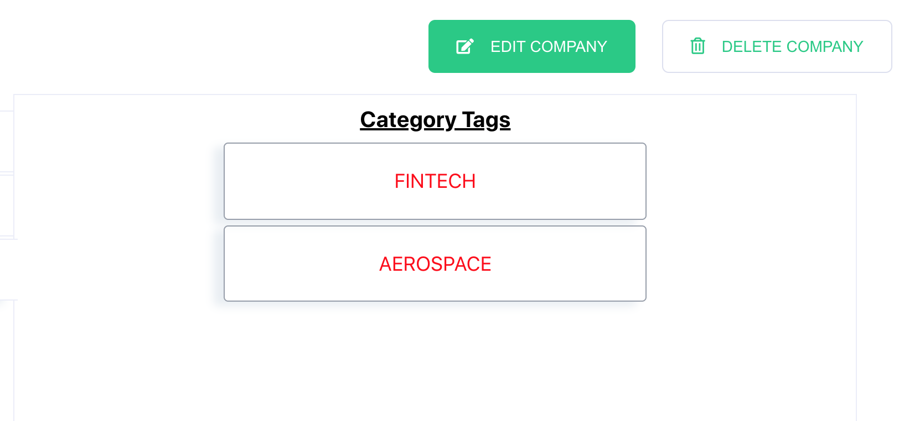
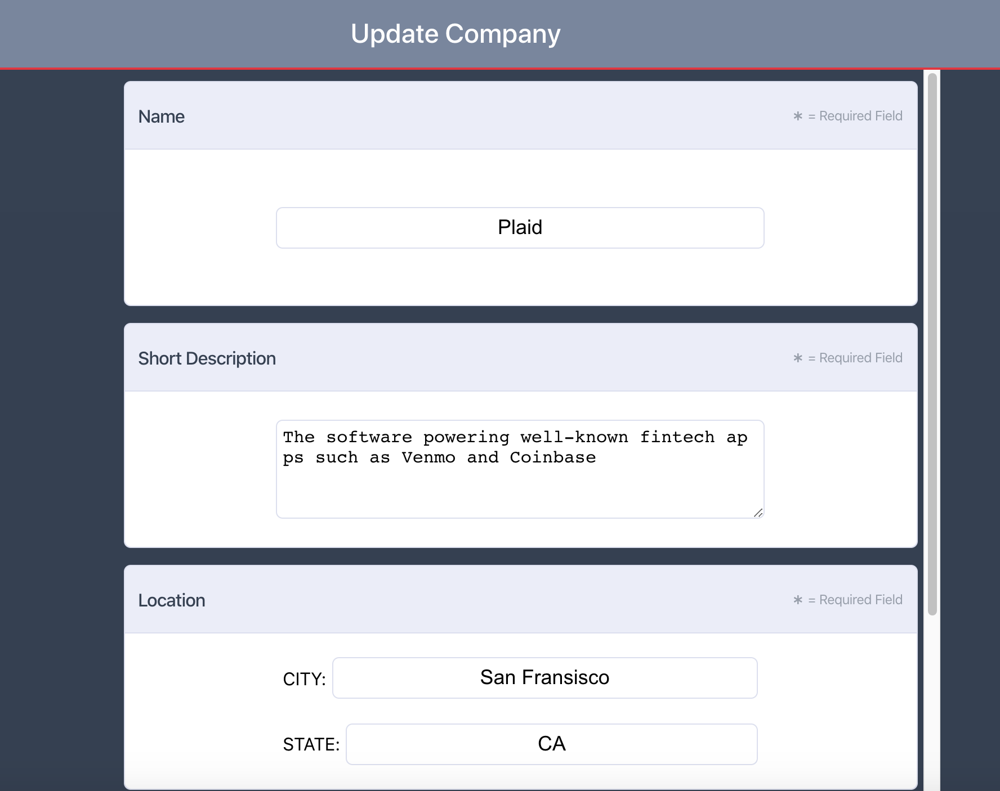
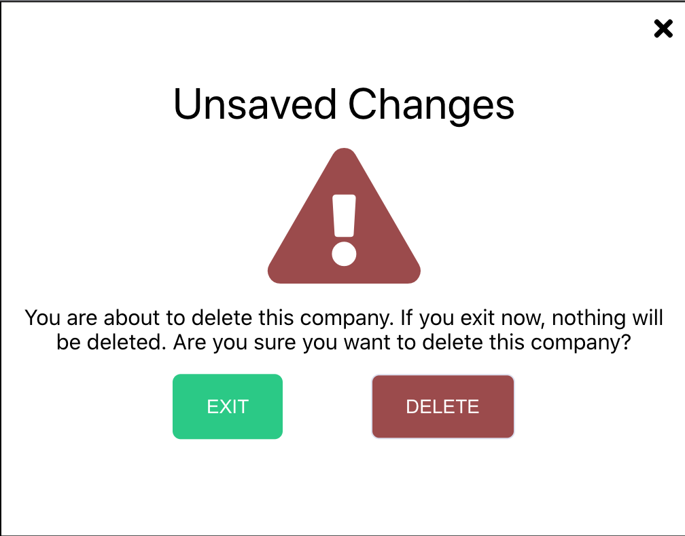
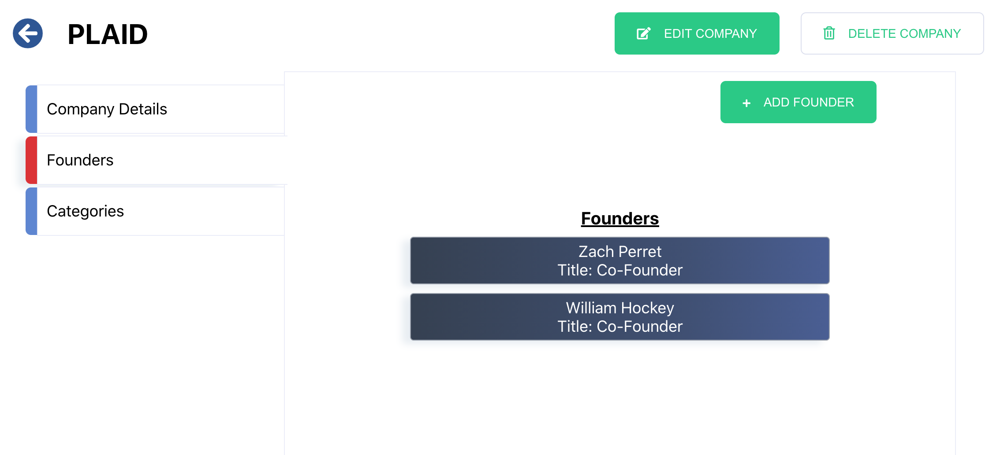
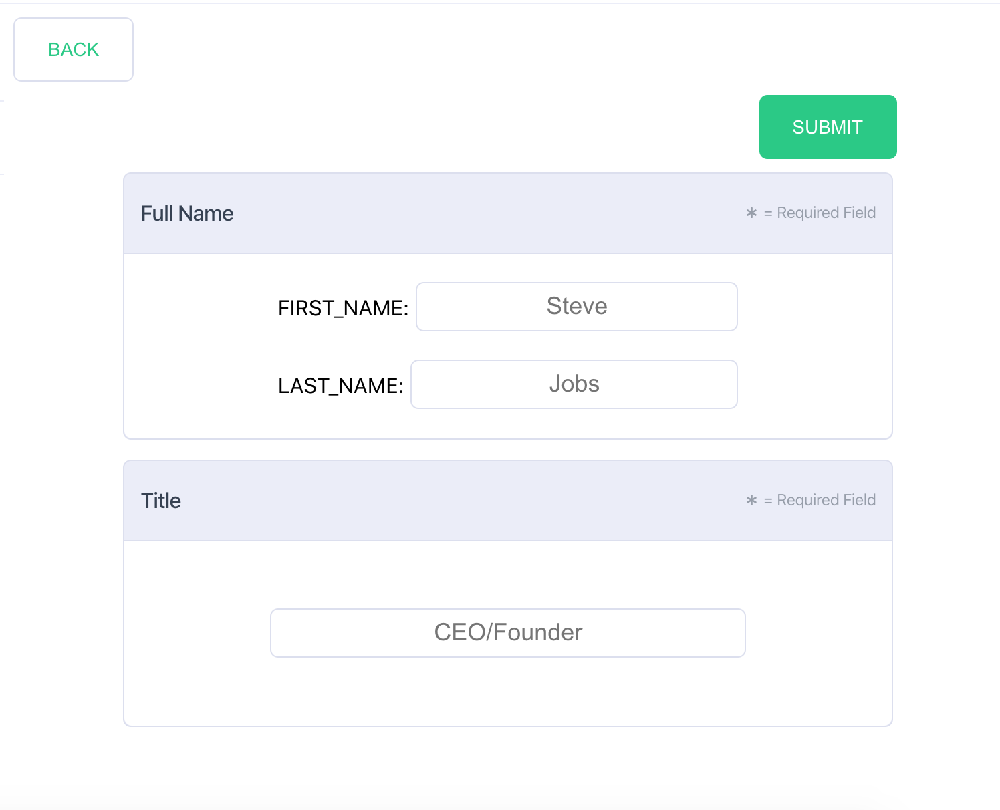

# Techstars Engineering: Fun Front to Back

Welcome to my take on the Techstars Engineering Full Stack code Challenge. I focused strongly on playing up my front end strengths with a strong UI and frontend test coverage. I built my application as a Ruby/ROR--React/Typescript/SCSS stack with some gentle cypress tests for E2E test coverage. See more information below for how to run my app locally and visit the deployed websites. 

## Getting Started
First, fork and this repository into your own GitHub account. This repo contains both sides of the application. 

### Ruby Version 

ruby 2.6.3p62 (2019-04-16 revision 67580)

### Rails Version

Rails 6.0.3.4

### Tech Stack

Ruby on Rails Backend with a PostgreSQL database 

React Frontend with Typescript, SCSS, Lodash, ClassNames, Ag Grid, Axios, Tabs, React Router, Hooks, Formik, Yup, Toastify

### Installation

The app back is built with Ruby on Rails which requires the following commands to run: 

    Run bundle to install the gems if using Bundler
    
    Run rails db:migrate
    
    Run rails db:seed

    Run rails s to start the server
    
  To run Tests run the following commands: 

    bin/rails test test/controllers/companies_controller_test.rb 
    
    These Two Commands are for prepping to run Cypress
    rails db:test:prepare
    RAILS_ENV=test rails s 

The app front is built with the JavaScript Library React which requires the following commands to run: 
    
    yarn install
    
    yarn start
    
    yarn test
    
    yarn cypress:open
    
I strongly value formatting and checking for mistakes before pushing which is why I incorporated a .prettierrc.js file and husky pre-commit hooks: 
    
    yarn fmt --> This command will format your files
    
    rufo . --> This is a VSCode plugin for formatting ruby files
    
## Motivation and Architectural Design

To approach the solution, I first planned out everything that needed to be accomplished. I am a big picture person, so I need to understand how everything works together before tackling smaller portions and getting into the nitty gritty. To do this, I read through the entire challenge, designed my backend architecture (relationships, tech stack, routes), and researched ways to display the design effectively on the frontend. From here, I coded out the Ruby/ROR--PostgreSQL application. It has been a long time since I have coded a full application in Ruby, so I welcomed the challenge. After reading through possible future scenarios, I wanted to setup the backend as best I could to be prepared. This meant adding a table for categories with a reference to companies. The following is my backend relationship structure: 

Companies --< Founders

Companies --< Categories

The relationships are very simple. One thing I knew for sure, is that given what I needed to display, if I setup my backend to send everything with companies (founders and categories), then I could cut down on costly network requests. I know there are ways to cut down on db calls as well, but to be honest, it has been a long time and I was on a crunch. Though I strongly see the value that is missing. Next, I chose strong params and model validations to increase the stability of the backend as well and write better, safer code. I did however intentionally create nearly all routes for every table. I could see the need for creating or deleting or updating categories and founders, so I felt it only made sense. I like to work extremely efficiently and felt this was a good way to do so, but I understand there are certain drawbacks to every choice. The backend was so simple, that I felt no need to write any modules or methods, though again, if things got more complicated, I would certainly see the need. That just about sums up my backend architecture. I would love to get back into Rails and really dive deep into all the magical things it can do!

As for the frontend architecture, one thing was for sure: I was going to use React and Typescript. That's the stack I use everyday and I strongly think Typescript makes you a better frontend developer. It forces clarity in the code and your understanding of the code. That said, given my time, there are some "any" types floating around, but don't think it isn't killing me. I am extremely meticulous and hate cutting corners, but sometimes typing can take a while to unfold. That said, I also used several libraries and frameworks to help better my UI. Those include the following:

React 
Typescript
SCSS
Lodash
ClassNames
Ag Grid
Axios
Tabs
React Router
Hooks
Formik
Yup
Toastify

Much of this stack is what I use on a day-to-day basis and is something I wanted to set-up from scratch and implement myself. This seemed like a great opportunity to do so. React Router, truly is magic, and I would with more time, have set up better routing and passing of state with location. I did use Hooks for state managment and all components are React:FC. The styling certainly needs some tweaking, there are a few components that don't scale effectively and I would like to spend some time cleaning it up and reusing classnames and styles where I can. As time dwindled (I set myself hard at 48hrs), I chose to sacrifice cleaner styling for better functionality overall.

I am a heavy proponent of lodash, so long as you understand how most of the functions work behind the scenes and understand the implications of increased time and memory costs. That being said, some of them are just wonderful and too hard to pass up. They work extremely effectively at handling null/undefined/"" and for having methods that work on obj/strings/arrays. I chose to use Ag Grid to display the companies, partially because I felt the old "card" style was overused and too reminiscent of my bootcamp days, but also because it is a great tool. Ag Grid, again, has some extremely powerful features such as passing data along and handling sorting and pagination. For the forms, I chose Formik because that is something I've used many times in my current position, and despite its flaws, works very effectively. It comes with context, Yup form validations, and is simple to use. Something to keep in mind is the mutating of objects on submit. It's often best to deep clone the formValues before submitting to avoid nasty immutability bugs. (Trust me, I've spent days there). 

As you can see, I put quite a bit of thought into my design. I like to work with libraries I have experience with and have good documentation. I trust my gut and sometimes something is popular for a reason, but there is nothing like trying out something new!

### Features

There are a few main features of the application. There are photos attached below for each portion of the challenge. When the user arrives on the homepage, they are greeted with a simple table of companies. These columns can be sorting asc/desc, and can be adjusted for width. Click the pagination buttons to see more entries. There is currently a search bar, which is there for future work and not currently functional, though as a user it might be easier to type in what I am looking for. In the upper right hand corner, the user will see a create button. This will navigate you to a form that when submitted, pops a simple toast letting you know whether your company has been successfully added or not. Watch out, the form validates, so you will be expected to input all form values and do so in the correct format. Navigate back to the home screen with the back button. If you want to see more details about the company, click on the blue company ID in the first column. This will open a side drawer with more information. 

This side drawer has 3 tabs: Company Details, Founders, Categories. The user is defaulted to Company details where they can see a brief overview of the company including the Name, Founded Date, City, State, Full Description, any associated Founders, and any associated Category tags. If there are no associated founders or categories, the div will be blank or display a message to alert the user. 

Clicking the Founders tab, brings the user to a page dedicated to all Founders associated with that Company. Click the Add Founder button to add a new instance (which is automatically added to the Company Details Page). This will again pop a toast to alert the user of the status of their Founder. Click the back button to return to the Founders List.

Lastly, click on the Categories tab to see all the Categories associated with the user. I imagine another similar form would go here to add tags to that Company, though for now it's just a display page. 

If you wish to Edit the Company at any point while the drawer is open, click the Edit Company button. This navigates you to the edit form. The form is shared with create, so depending on where you come from, the application will decide which kind of form to display to you. The edit form pre-populates the form data allowing the user to just submit if they so chose. Upon submit, the user may return to the Companies page. This is a great place to update my router and have routes for each tab of the drawer, so that the user may navigate back to it effectively (without just using history.push('prev'). 

Lastly, on the open drawer for the singular company instance, the user may click the Delete button at anytime to delete that Company. Thanks to dependent destroy on the backend, this should delete any associated Founders. Upon clicking the button, the user will be met with a smaller modal to make sure they understand their choice before moving forward. Upon clicking to delete, both the modal and the drawer will close (because that Company no longer exists) and the table will be updated. 

### Part 1 : Companies Index

### Part 2 : Companies Create

### Part 3 : Company Details

### Part 4 : Founders

### Part 5 : Tests
For tests, I strongly focused on frontend testing, but did not get as much done as I was hoping for. Because the backend is so simple and I have only written tests in RSPEC for modules and methods (never controllers), I chose to focus my attention elsewhere. There seems to be a lot of debate about testing controllers, so I would love to learn more about Ruby testing practices, as testing is something that has become near and dear to my heart. I don't follow TDD, but do strongly value writting good tests. For frontend coverage, I used React Testing library and sinon to mock axios requests. I wrote a set of brief tests to give you a taste for my testing style. I should have used dataTest attributes as opposed to classnames and would with more time implement that app wide. It's extremely important to test static data and functionality rather than something that is brittle and may change. I did use a few snapshots for some of the simpler tests. My current company is currently going through a phase of deciding what parts of the React app to test with RTL and which to test with Cypress, which may explain some of the overlap I have here.

Cypress is my baby. I work on it most days, and especially deploy days bi-weekly. I am responsible for nearly all Cypress tests at my current company and was super excited to implement it as my E2E testing suite for this challenge. Unfortunately, it was the last feature for my to add, so it only has effective frontend coverage. While all the POST/PATCH requests are mocked, rest assured I tested them and they do update the DB, so if you were to remove the mocks, it would alter the local DB. I tried to setup a mock db controller in Ruby and ran out of time, so you may see that db_controller floating around. I did manage to fill out all the forms and perform all CRUD operations in Cypress. I chose to remove the DELETE in case it was not effectively mocked and altered the DB before sending my app your way. There is quite a bit of room for improvement, and I recognize the lack of overall test coverage. 

### Part 6 : Deployment 
 The frontend is deployed to Firebase and can be found here: 
 * [Deployed Website front-end](https://tech-stars-challenge.web.app/companies)
 
Having tried TIRELESSLY to deploy to beanstalk and wasting several hours there, I resigned myself to heroku backend deployment, so I apologize for the disappointment. If anyone has suggestions for doing so effectively, I would be first in line to learn!

* [Back End](https://tech-stars.herokuapp.com/companies)

ENDPOINTS ARE AS FOLLOWS:

GET:
/companies
/founders
/categories

POST: 
/companies
/founders

### Next Steps
I appreciate your time and consideration, and had a great time nonetheless completing this challenge. I'll definitely be improving it in my free time! And seriously, someone help me use elastic beanstalk. It eludes me! PS. Docker deployment would have been my other choice with more time. 
