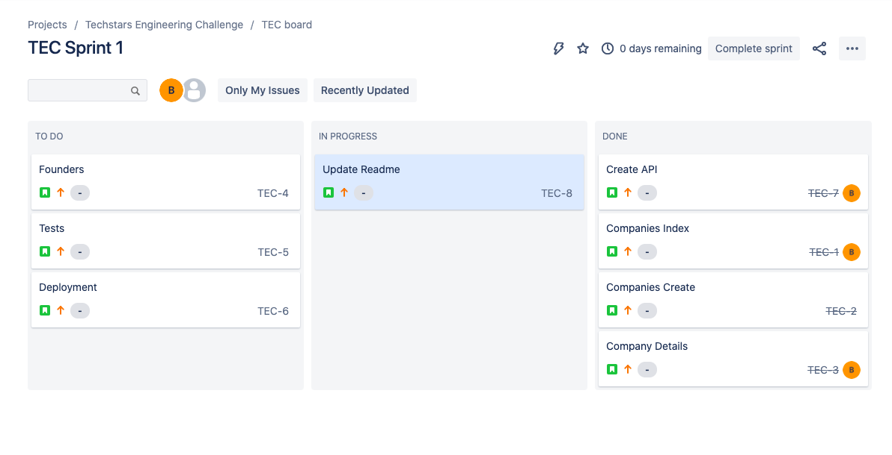

# Full Stack Challenge

A fun front to back app with a Company Directory.

## Installation

- Clone this repo
- open company-directory-fe
- npm install
- npm start

Runs the app in the development mode.
Open [http://localhost:3000](http://localhost:3000) to view it in the browser.

## Tech/Framework Used

JavaScript, React, Bootstrap, Nodejs, and Express

## API Reference

# Companies

[https://companydirectoryts.herokuapp.com/companies](https://companydirectoryts.herokuapp.com/companies)

# Founders

[https://companydirectoryts.herokuapp.com/founders](https://companydirectoryts.herokuapp.com/founders)

- This code can be found here: [https://github.com/justcallmebeef/companyDirectorBE](https://github.com/justcallmebeef/companyDirectorBE)

## Project Management: Jira

### Future Implementation Goals

- Add Founders to Companies
- Add tests with React Testing Library
- Add TypeScript
- Add Redux Toolkit or Recoil for data persistance and management

### Author

- **Bethany Mitch** - _BM_ - [justcallmebeef](https://github.com/justcallmebeef)
